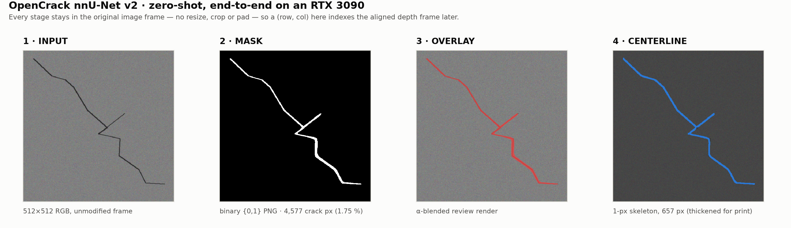

# rebot_crack_vision

**Zero-shot crack segmentation for a reBot B601-DM concrete-inspection arm.**

RGB image → [OpenCrack nnU-Net v2](https://huggingface.co/fadeevla/opencrack-nnunet) → binary mask →
review renders → one-pixel centerline, with the whole chain held to a single rule: **nothing resizes,
crops or pads**, so a `(row, col)` in the mask is the same `(row, col)` in the original frame — and
later, in the aligned depth frame a robot trajectory will be built from.

<p align="center">
  
</p>

---

## The question this repository exists to answer

Can publicly released crack weights do useful work **zero-shot** on Intel RealSense D405 imagery — or
does the capstone have to fund its own labelling and training effort?

Phase 1 (this repository, in progress) builds the perception plumbing and the evidence to answer that
honestly. It deliberately stops short of depth projection, hand-eye calibration, ROS integration and
any training — each deferral is recorded as an ADR in [`docs/adr/`](docs/adr).

## Status

| | |
|---|---|
| Task cards approved | **9 of 16** (`TC-001` … `TC-009`) |
| Unit tests | **46 passing** |
| Independent review gates | **12** — 3 cards were sent back for revision |
| Model | OpenCrack nnU-Net v2 2D, fold 0, 92.5 M params, sha256-pinned |
| Inference | real, on an RTX 3090 — ≈5.8 s per 512² image wall-clock including process start-up |
| Zero-shot quality on real D405 imagery | **not yet claimed** — no camera attached; see [`docs/D405_TEST_PLAN.md`](docs/D405_TEST_PLAN.md) |

The live board is [`task_cards/TASK_INDEX.md`](task_cards/TASK_INDEX.md).

## Presentation

A self-contained slide deck covering this work lives in [`presentation/`](presentation) — open
[`presentation/index.html`](presentation/index.html) in any browser (arrow keys to move, `Ctrl-P` to
export a PDF). [`presentation/SLIDES.md`](presentation/SLIDES.md) carries the same material as
speaker notes, and every figure is regenerated from committed artefacts by
[`presentation/tools/make_figures.py`](presentation/tools/make_figures.py).

**[`docs/TECHNICAL_APPROACH.md`](docs/TECHNICAL_APPROACH.md)** is the engineering write-up behind
the deck: how the segmentation model actually works, how the mask becomes an ordered 3D path, the
forward/inverse kinematics for the reBot B601-DM (including a real mistake in the gripper's
boresight axis, found by checking the actual mesh geometry rather than a coordinate-frame
coincidence, and fixed), the velocity analysis, and how the Isaac Sim scene and trajectory video
are built. Read this if the deck raises "how does that actually work?" — it's written for that.

## Repository map

```
src/crackvision/     prepare_inputs · inference · visualize · config · logging · naming
scripts/             check_env · fetch_model · verify_model · smoke_test
tests/               46 unit tests (no GPU required)
docs/                ARCHITECTURE · INTERFACES · RISKS · VALIDATION_PLAN · REVIEW_LOG · adr/
task_cards/          the 16 specs this project is built from, plus the live status board
presentation/        slide deck, figures, and the vision → path → arm demo
config/project.yaml  every tunable; no magic numbers in source
env.sh               the launcher — scrubs ROS off the interpreter path, then runs your command
```

## Running it

Everything runs through the launcher, which is what keeps a ROS-poisoned shell from reaching the
interpreter (`docs/RISKS.md` R-01):

```bash
./env.sh python scripts/check_env.py          # Level 1 — environment and GPU
./env.sh python scripts/verify_model.py       # model tree + sha256 + semantic checks
./env.sh python scripts/smoke_test.py         # Level 2 — synthetic end-to-end on the GPU (~14 s)
./env.sh pytest tests/ -v                     # 46 unit tests
```

Then, on your own imagery:

```bash
cp your_images/*.png data/input_originals/
./env.sh python -m crackvision.prepare_inputs   # force 3-channel RGB PNG, write case_map.json
./env.sh python -m crackvision.inference        # nnUNetv2_predict_from_modelfolder, fold 0
./env.sh python -m crackvision.visualize        # mask · overlay · 3-panel comparison
```

> The full operator quickstart (`run_test.sh`, one command for the whole chain) is `TC-011`'s
> deliverable and is not written yet; `TC-016` finalises this file. What is above is verified to
> work today.

Model weights are **not** in this repository (268 MB, and git-lfs is not available here) —
`./env.sh python scripts/fetch_model.py` downloads them from Hugging Face and writes
`config/model_manifest.json`, which pins every file by size, sha256 and upstream revision.

## Attribution

- **OpenCrack nnU-Net** — `fadeevla/opencrack-nnunet`, CC-BY-4.0.
- **nnU-Net v2** — Isensee, F. et al., *nnU-Net: a self-configuring method for deep learning-based
  biomedical image segmentation*, Nature Methods 18, 203–211 (2021). Apache-2.0.

Crack imagery in `presentation/assets/` is synthetic, generated by this project's own smoke test.
