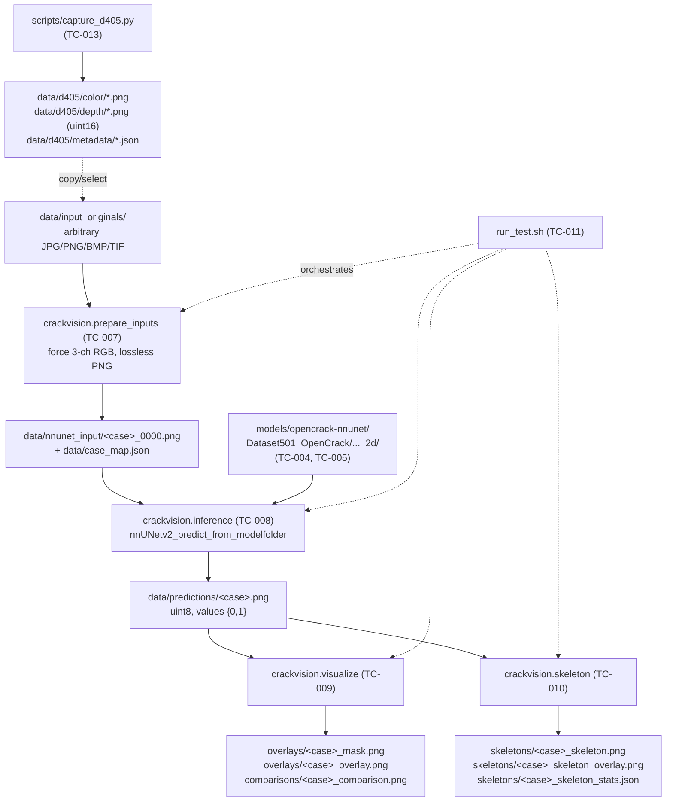

# ARCHITECTURE.md — rebot_crack_vision

**Project:** Crack segmentation perception front-end for a reBot-DevArm B601-DM bridge/concrete
inspection capstone.
**Status:** ARCHITECTURE FROZEN — no implementation performed. Planned 2026-09-16.
**Audience:** the Claude Sonnet implementation agents executing `task_cards/`.

Read this file completely before executing any task card. If you believe the architecture is wrong,
say so in your completion report — **do not silently redesign**. See `task_cards/AGENT_INSTRUCTIONS.md`.

---

## 1. Project goal

Determine whether the publicly released **OpenCrack nnU-Net v2 2D** model
(`fadeevla/opencrack-nnunet`) gives usable **zero-shot** crack segmentation on imagery captured by an
**Intel RealSense D405**, and build the reusable perception plumbing around it.

## 2. Scope

### In scope for THIS implementation phase

```
RGB image  →  OpenCrack nnU-Net v2  →  binary mask  →  visualization  →  1-px skeleton
```

plus **D405 RGB+depth capture preparation** (capture tooling and on-disk formats; the depth is saved
but not yet consumed).

### Explicitly OUT of scope for this phase

| Deferred | ADR |
|---|---|
| Depth→3D projection of the centerline | `adr/002` |
| Ordered path extraction / graph traversal of the skeleton | `adr/008` |
| Camera↔robot extrinsic calibration, hand-eye | `adr/009` |
| Robot trajectory generation, arm motion, MoveIt2 | `adr/009` |
| ROS 2 nodes / topics / launch files | `adr/009` |
| Fine-tuning, retraining, LoRA, domain adaptation | `adr/010` |
| Quantitative IoU/Dice evaluation against labels | `docs/VALIDATION_PLAN.md` §Level 3 |
| Real-time / streaming inference | — |

### Future scope (the pipeline this phase feeds)

```
D405 RGB ─► OpenCrack ─► binary mask ─► cleanup ─► skeletonize ─► 1-px centerline
                                                                        │
                                                          ┌─────────────┘
                                                          ▼
                                              ordered path (graph traversal)
                                                          ▼
                                            D405 depth association (aligned)
                                                          ▼
                                                 3D crack trajectory
                                                          ▼
                                          camera→base transform (hand-eye)
                                                          ▼
                                              reBot B601-DM arm trajectory
```

The **contract this phase must honour**: the skeleton is emitted as a pixel-indexed binary raster in
the *original image frame*, so that a later stage can index the aligned depth frame with the very
same `(row, col)`. Nothing in this phase may resize, crop, or pad the output relative to the input.

---

## 3. High-level pipeline (this phase)



---

## 4. Verified upstream facts (researched 2026-09-16 — do not re-derive)

These were confirmed against live upstream sources during planning. A task card that finds one of
these to be false must report it as a BLOCKER, not work around it silently.

### 4.1 Model repository `fadeevla/opencrack-nnunet`

- Last modified **2026-06-20**, `gated: false`, license **CC-BY-4.0**, pipeline `image-segmentation`.
- Exact file tree (7 files):

```
.gitattributes
README.md
reproducibility/splits_final.json
Dataset501_OpenCrack/nnUNetTrainer__nnUNetPlans__2d/dataset.json                 (  0.00 MB)
Dataset501_OpenCrack/nnUNetTrainer__nnUNetPlans__2d/dataset_fingerprint.json     (  6.74 MB)
Dataset501_OpenCrack/nnUNetTrainer__nnUNetPlans__2d/plans.json                   (  0.01 MB)
Dataset501_OpenCrack/nnUNetTrainer__nnUNetPlans__2d/fold_0/checkpoint_ep0500.pth (268.09 MB)
```

**The repo is already laid out exactly as an nnU-Net v2 results tree.** No file shuffling is needed —
only placement/symlinking (TC-005).

> ⚠️ The model card prose says "`nnUNetPlans.json`", but the actual file is named **`plans.json`**,
> which is what nnU-Net v2 requires. Trust the file tree, not the prose.

- `dataset.json`:
```json
{"channel_names": {"0":"R","1":"G","2":"B"},
 "labels": {"background": 0, "crack": 1},
 "numTraining": 49531, "file_ending": ".png",
 "name": "OpenCrack-cat1",
 "overwrite_image_reader_writer": "NaturalImage2DIO"}
```
- `plans.json` (2d config): `patch_size [256,256]`, `batch_size 49`, `spacing [1.0,1.0]`,
  three × `ZScoreNormalization`, `PlainConvUNet`, 7 stages, ≈92.5 M params.
- Reported quality: 0.539 IoU / 0.641 clIoU(τ=4) on the OpenCrack test cohort.
- Stated throughput: ≈1.45 img/s at 2048², ≈21 img/s on 600-px tiles, on an **8 GB** GPU. FP16 is
  IoU-identical to FP32.
- Stated limitations that matter to us: over-fires on crack-like texture; over-fires on masonry
  bonds/mortar lines; collapses on wide road scenes. **Close-up concrete/bridge-deck imagery — our
  regime — is in-domain.**

### 4.2 nnU-Net v2

- PyPI `nnunetv2` latest **2.8.1** (2026-07-01). `requires_python >=3.10`.
  Dependency pin of note: **`torch>=2.1.2, !=2.9.*`**.
- Relevant console entry points:
  - `nnUNetv2_predict` → needs `-d/-c/-f` **and** resolves the dataset through the `nnUNet_results`
    environment variable.
  - **`nnUNetv2_predict_from_modelfolder`** → takes **`-m <model folder>`** directly and, per its own
    argparse help, exists precisely "when the nnunet environment variables (nnUNet_results) are not set".
- **We use `nnUNetv2_predict_from_modelfolder` as the primary invocation** (`adr/006`). It needs the
  folder to contain `plans.json`, `dataset.json` and `fold_0/`, which the HF repo already provides.
- Verified `predict_from_modelfolder` flags: `-i -o -m -f -step_size --disable_tta --verbose
  --save_probabilities --continue_prediction -chk -npp -nps -prev_stage_predictions -device
  --disable_progress_bar --not_on_device`.
  Defaults that MUST be overridden: `-f` defaults to `(0,1,2,3,4)` → pass **`-f 0`**;
  `-chk` defaults to `checkpoint_final.pth` → pass **`-chk checkpoint_ep0500.pth`**.
- **Input naming: `_0000` IS still required.** Confirmed from `nnunetv2/inference/predict_from_raw_data.py`
  argparse help: *"Remember to use the correct channel numberings for your files (_0000 etc). File
  endings must be the same as the training dataset!"* → `.png`.

### 4.3 `NaturalImage2DIO` — the single most important contract

Read verbatim from `nnunetv2/imageio/natural_image_reader_writer.py`:

- `supported_file_endings = ['.png', '.bmp', '.tif']` — **`.jpg`/`.jpeg` are deliberately commented
  out** ("jpg not supported because we cannot allow lossy compression"). PNG only.
- `read_images()` loads **one** file per channel-group with `skimage.io.imread` and, for a 3-D array,
  transposes `(H,W,C) → (C,1,H,W)`. That means:

  > **ONE `<case>_0000.png` file supplies ALL THREE R/G/B channels.**
  > There is no `_0001` / `_0002`. The upstream example in that file is literally
  > `Dataset120_RoadSegmentation/imagesTr/img-11_0000.png`.

- It asserts `shape[-1] in (3, 4)` for 3-D arrays. So:
  - **RGBA (4 channels) → 4 channels ≠ the 3 the plans expect → downstream shape mismatch.**
  - **Grayscale (2-D) → 1 channel ≠ 3 → mismatch.**
  - ⇒ `prepare_inputs` (TC-007) **must** force every image to exactly 3-channel 8-bit RGB.
- `write_seg()` does `io.imsave(fname, seg[0].astype(np.uint8 if max<255 else np.uint16))`.

  > **⚠️ Predictions are PNGs whose pixel values are literally `0` and `1`, not `0` and `255`.**
  > They look uniformly black in an image viewer. This is correct, not a bug. All downstream code
  > must threshold `> 0`, and the human-viewable mask is a separate `×255` render (TC-009).

### 4.4 PyTorch

- Latest PyPI `torch` **2.14.0**; `requires_python >=3.10`.
- `download.pytorch.org/whl/` currently offers cu126, cu128, cu129, cu130 variants
  (cu126 and cu130 carry the widest recent coverage incl. 2.13.0 / 2.14.0).
- Driver 580.173.02 (CUDA 13.0) satisfies **all** of them. RTX 3090 = **sm_86**, supported by all.
- **A system CUDA toolkit is NOT required.** The pip wheel bundles its own CUDA runtime; only the
  kernel driver matters. The box's default `nvcc` being 11.8 is irrelevant. (`adr/005`)
- **Chosen:** `torch` from the **cu126** index (widest availability; comfortably sm_86; well past
  nnU-Net's `!=2.9.*` exclusion). `cu130` is the documented fallback.

### 4.5 RealSense / pyrealsense2

- PyPI `pyrealsense2` **2.58.4.10922**, `requires_python >=3.9`, manylinux x86_64 wheels for
  **cp310, cp311, cp312, cp313** → Python 3.11 is safe.
- System `librealsense2` 2.57.7 present via apt (ROS-scoped); `rs-enumerate-devices` and
  `realsense-viewer` are on `/opt/ros/humble/bin`. The pip wheel is self-contained and does not need
  the apt library.
- D405: a short-range **stereo** depth camera. Its RGB stream comes off the **left infrared imager**,
  not a separate colour sensor — so `color` and `depth` originate from very nearly the same optical
  center. Practical consequences baked into TC-013:
  - Recommended default config: `color` 848×480 @ 30 (or 1280×720 @ 30) + `depth` 848×480 @ 30.
  - `rs.align(rs.stream.color)` is still the **correct, cheap default** and is what makes
    `mask[r,c] ↔ depth[r,c]` valid. Do it.
  - Ideal depth range ≈ **7 cm – 50 cm**, which matches the planned 10–40 cm evaluation distances.
  - Depth is `uint16` in **depth units** (typically 0.0001 m = 0.1 mm for D405, vs 0.001 m for D4xx).
    **Never hard-code the scale** — always read `depth_sensor.get_depth_scale()` and write it into
    the per-frame metadata JSON.
- **No D405 is attached to this machine right now** (`lsusb` confirms). TC-012/TC-013 must be fully
  implementable and CI-testable with no hardware.

---

## 5. Directory structure

```
~/Projects/rebot_crack_vision/
├── README.md                     [git]  entry point, quickstart
├── .gitignore                    [git]
├── env.sh                        [git]  ⭐ the scrubbing launcher — see §8
├── run_test.sh                   [git]  one-command workflow (TC-011)
├── pyproject.toml                [git]  editable install of src/crackvision
│
├── requirements/                 [git]
│   ├── environment.yml                  conda env spec (python=3.11)
│   ├── requirements-core.txt            pinned non-torch pip deps
│   ├── requirements-torch.txt           torch install command + index URL (documented, not pip-parsable)
│   └── requirements-realsense.txt       pyrealsense2 (separate: optional/hardware-gated)
│
├── config/                       [git]
│   ├── project.yaml                     tunables: colours, thresholds, stream configs
│   └── model_manifest.json              expected model files + sizes + sha256 (written by TC-004)
│
├── docs/                         [git]  ← you are here
│   ├── ARCHITECTURE.md
│   ├── MACHINE_STATE.md
│   ├── IMPLEMENTATION_PLAN.md
│   ├── INTERFACES.md                    ⭐ the exact I/O contracts
│   ├── RISKS.md
│   ├── VALIDATION_PLAN.md
│   ├── D405_TEST_PLAN.md
│   ├── COMPLETION_LOG.md                append-only; every card appends its report
│   └── adr/                             architecture decision records 001–010
│
├── task_cards/                   [git]
│   ├── AGENT_INSTRUCTIONS.md            ⭐ read first, every time
│   ├── TASK_INDEX.md                    dependency table + status board
│   └── TC-0NN-*.md
│
├── src/crackvision/              [git]  the library; every module is also a `python -m` CLI
│   ├── __init__.py
│   ├── config.py                        resolves project paths + loads config/project.yaml
│   ├── naming.py                        ⭐ case_id derivation + path mapping (single source of truth)
│   ├── logging_setup.py                 uniform logging + exit codes
│   ├── prepare_inputs.py                TC-007
│   ├── inference.py                     TC-008
│   ├── visualize.py                     TC-009
│   ├── skeleton.py                      TC-010
│   └── realsense_capture.py             TC-013
│
├── scripts/                      [git]  one-shot operational CLIs (not library code)
│   ├── check_env.py                     TC-003  Level-1 smoke test
│   ├── fetch_model.py                   TC-004  HF download + manifest
│   ├── verify_model.py                  TC-005  model tree validation
│   ├── smoke_test.py                    TC-006  synthetic end-to-end GPU check
│   └── check_realsense.py               TC-012  camera-optional RealSense probe
│
├── tools/                        [git]  developer/authoring helpers, not part of the pipeline
│   └── dataset_manifest.py              TC-015  D405 eval-set metadata CSV tooling
│
├── tests/                        [git]  pytest; must pass with NO GPU and NO camera
│   ├── conftest.py
│   ├── test_naming.py
│   ├── test_prepare_inputs.py
│   ├── test_visualize.py
│   ├── test_skeleton.py
│   ├── test_realsense_import.py
│   └── test_integration_smoke.py
│
├── models/                       [IGNORED]  ≈275 MB HF snapshot
│   └── opencrack-nnunet/Dataset501_OpenCrack/nnUNetTrainer__nnUNetPlans__2d/…
│
├── nnunet/                       [IGNORED]  project-local nnU-Net roots (adr/004)
│   ├── raw/                                 unused this phase (kept so the env var is valid)
│   ├── preprocessed/                        unused this phase
│   └── results/Dataset501_OpenCrack -> ../../models/opencrack-nnunet/Dataset501_OpenCrack  (symlink)
│
├── data/                         [IGNORED except .gitkeep]
│   ├── input_originals/                 ⭐ USER DROPS IMAGES HERE
│   ├── nnunet_input/                    generated: <case>_0000.png
│   ├── predictions/                     generated: <case>.png  (values 0/1!)
│   ├── overlays/                        generated: _mask.png, _overlay.png
│   ├── comparisons/                     generated: _comparison.png
│   ├── skeletons/                       generated: _skeleton.png, _skeleton_overlay.png, _stats.json
│   ├── case_map.json                    generated: the authoritative case↔source mapping
│   ├── smoke_test/                      generated: synthetic fixtures + their outputs
│   └── d405/
│       ├── color/                       <session>_<NNNNNN>_color.png   (8-bit RGB)
│       ├── depth/                       <session>_<NNNNNN>_depth.png   (16-bit, raw units)
│       └── metadata/                    <session>_<NNNNNN>.json + <session>_session.json
│
└── logs/                         [IGNORED]  <tool>_<UTC>.log  +  <tool>_latest.json
```

### Source-control policy

| Class | Examples | Tracked? |
|---|---|---|
| Source & config | `src/`, `scripts/`, `tools/`, `tests/`, `config/`, `requirements/`, `*.sh`, `pyproject.toml` | ✅ yes |
| Planning docs | `docs/`, `task_cards/`, `README.md` | ✅ yes |
| Directory placeholders | `data/**/.gitkeep`, `logs/.gitkeep` | ✅ yes |
| Model weights | `models/`, `nnunet/` | ❌ **no** — 268 MB, and **git-lfs is not installed** |
| Any imagery | `data/**` (except `.gitkeep`) | ❌ no |
| Generated logs/reports | `logs/**` | ❌ no |
| Env dirs | `.venv/`, `__pycache__/`, `*.egg-info/` | ❌ no |

`.gitignore` is authored in TC-001 and must not be loosened by a later card.

---

## 6. Component boundaries

Each component is a module in `src/crackvision/` (or a script in `scripts/`) that is **independently
runnable** and communicates only through files on disk. No component imports another's internals
except `config.py`, `naming.py` and `logging_setup.py`, which are shared leaf utilities.

| # | Component | Module | Card | Reads | Writes |
|---|---|---|---|---|---|
| 0 | Shared config/paths | `crackvision.config` | TC-001/002 | `config/project.yaml`, env | — |
| 0 | Naming contract | `crackvision.naming` | TC-007 | — | — (pure functions) |
| 0 | Logging/exit codes | `crackvision.logging_setup` | TC-001 | — | `logs/` |
| 1 | Environment verification | `scripts/check_env.py` | TC-003 | system | `logs/check_env_latest.json` |
| 2 | Model acquisition | `scripts/fetch_model.py` | TC-004 | HF hub | `models/`, `config/model_manifest.json` |
| 2 | Model wiring/validation | `scripts/verify_model.py` | TC-005 | `models/` | `nnunet/results/` symlink |
| 3 | Input preparation | `crackvision.prepare_inputs` | TC-007 | `data/input_originals/` | `data/nnunet_input/`, `data/case_map.json` |
| 4 | Inference runner | `crackvision.inference` | TC-008 | `data/nnunet_input/`, `models/` | `data/predictions/`, `logs/` |
| 5 | Visualization | `crackvision.visualize` | TC-009 | predictions + case_map | `data/overlays/`, `data/comparisons/` |
| 6 | Skeletonization | `crackvision.skeleton` | TC-010 | predictions + case_map | `data/skeletons/` |
| 7 | D405 probe | `scripts/check_realsense.py` | TC-012 | USB | `logs/check_realsense_latest.json` |
| 7 | D405 capture | `crackvision.realsense_capture` | TC-013 | camera | `data/d405/**` |
| 8 | One-command workflow | `run_test.sh` | TC-011 | — | orchestrates 3→6, prints summary |
| 9 | Eval-set metadata tooling | `tools/dataset_manifest.py` | TC-015 | `data/d405/metadata/` | `data/d405/eval_manifest.csv` |

**Rule:** a card owns its files exclusively. Two cards never write the same file. See
`TASK_INDEX.md` §File ownership.

---

## 7. Naming conventions & data flow

Full normative spec: **`docs/INTERFACES.md`**. Summary:

```
data/input_originals/Deck Crack 01.JPG
        │  case_id = sanitize(stem)  →  "Deck_Crack_01"
        ▼
data/nnunet_input/Deck_Crack_01_0000.png        (3-ch RGB, lossless)
        ▼  nnUNetv2_predict_from_modelfolder
data/predictions/Deck_Crack_01.png              (uint8, values {0,1})
        ├─► data/overlays/Deck_Crack_01_mask.png          (uint8 {0,255})
        ├─► data/overlays/Deck_Crack_01_overlay.png       (RGB, mask alpha-blended)
        ├─► data/comparisons/Deck_Crack_01_comparison.png (original | mask | overlay)
        └─► data/skeletons/Deck_Crack_01_skeleton.png     (uint8 {0,255})
            data/skeletons/Deck_Crack_01_skeleton_overlay.png
            data/skeletons/Deck_Crack_01_skeleton_stats.json
```

`data/case_map.json` is the authoritative join table between `case_id` and the original filename.
Downstream components look up the original there rather than re-deriving it.

**`case_id` sanitisation rule (normative):** take `Path(src).stem`; replace every character not in
`[A-Za-z0-9-]` with `_`; collapse runs of `_`; strip leading/trailing `_`; if the result ends with
`_0000`, strip that suffix; if empty, use `image`. Collisions are resolved by appending `__2`,
`__3`, … in sorted-source-path order, which makes the mapping deterministic.

**Frame invariant:** every generated raster in the pipeline has **exactly the same (H, W)** as the
original image. No component may resize, crop, pad or rotate. This is what lets a future stage index
the aligned D405 depth frame with skeleton pixel coordinates.

---

## 8. Environment strategy

### 8.1 The environment

- Conda env named **`crackvision`**, **Python 3.11**, created from `requirements/environment.yml`.
- Why 3.11 and not 3.10 or 3.12:
  - 3.10 collides with the ROS `PYTHONPATH` leak *and* with the 272-package `~/.local/lib/python3.10`
    user-site (both verified — `MACHINE_STATE.md` §4).
  - `~/.local/lib/python3.11` is **empty**.
  - `scikit-image` ≥ 0.26 requires `>=3.11`.
  - `pyrealsense2` ships a `cp311` manylinux wheel.
  - `nnunetv2` requires `>=3.10`; torch requires `>=3.10`. 3.11 satisfies everything.
- The project is installed into the env in editable mode (`pip install -e .`) so `python -m crackvision.*`
  works from anywhere.
- **No existing env is touched.** (`adr/003`)

### 8.2 `env.sh` — the scrubbing launcher (mandatory)

Because ROS Humble is unconditionally sourced from `~/.bashrc`, a plain `conda activate crackvision`
is **not sufficient**. `env.sh` must, before handing off:

1. `unset PYTHONPATH` (ROS 3.10 site-packages leak — verified F-1)
2. Remove `/opt/ros/*` and `/usr/local/cuda-11.8/lib64` entries from `LD_LIBRARY_PATH` (F-2)
3. `unset PYTHONHOME`; export `PYTHONNOUSERSITE=1` (defence in depth against F-3)
4. Activate the `crackvision` conda env
5. Export project-local nnU-Net roots (`adr/004`):
   `CRACKVISION_ROOT`, `nnUNet_raw`, `nnUNet_preprocessed`, `nnUNet_results`
6. Export `nnUNet_compile=f` (matches how the model was trained; avoids torch.compile surprises)
7. Be usable **both** as `source env.sh` and as `./env.sh <cmd> …`

Every documented command in this project is invoked through `env.sh`. A card whose acceptance test
runs raw `python` has not met its acceptance criteria.

### 8.3 Not touched, ever

`~/.bashrc`, `/usr/local/cuda*`, NVIDIA drivers, `/opt/ros/**`, any other conda env, the running
NaVILA VLM server (PID 10831), `~/rebot_ws`, `~/Projects/k1_research`.

---

## 9. GPU strategy

- Inference device defaults to `cuda`; `--device` is always exposed and `cpu` always works.
- **All 24 GB is free as of 2026-09-16** — a 16 GB NaVILA VLM squatter was stopped with explicit user
  approval during planning. But this workstation is shared with active robotics projects that park
  multi-GB servers on GPU 0, so **no card may assume an empty GPU**. Keep the degradation ladder, in
  order, for when CUDA OOM occurs:
  1. `--not_on_device` (moves the tile aggregation buffer to CPU RAM — biggest single win)
  2. lower `-npp`/`-nps` (RAM, not VRAM, but reduces contention)
  3. `--disable_tta` (mirroring TTA costs ~8× forward passes; accuracy drops slightly)
  4. downscale very large inputs (**must** be an explicit, logged, opt-in flag — it breaks the frame
     invariant in §7, so the downscale factor is recorded in `case_map.json`)
  5. `--device cpu` (slow but always correct)
- `inference.py` must **catch `torch.cuda.OutOfMemoryError` / RuntimeError containing "out of memory"
  and print this ladder**, not just crash.
- **Never kill a GPU process.** If VRAM is short, degrade and report. (The one-time stop of PID 10831
  was a user decision taken in the planning session, not a precedent.)
- Never call `nvidia-smi` to kill processes. Never set `CUDA_VISIBLE_DEVICES` to anything but `0`
  unless the user asks.
- FP16 is upstream-verified IoU-identical; we do not force a precision — nnU-Net's own default
  (autocast) is used.

---

## 10. RealSense strategy

- `pyrealsense2` is installed **separately** from the core requirements
  (`requirements-realsense.txt`), so a broken camera stack can never block segmentation work.
- All RealSense imports are **lazy and guarded**: `crackvision.realsense_capture` must import
  successfully (and its tests must pass) on a machine with no `pyrealsense2` and no camera; it
  reports a clean, actionable error at *run* time, exit code 3.
- Capture pipeline: `rs.pipeline` with explicit `rs.config.enable_stream` for colour and depth,
  `rs.align(rs.stream.color)`, N warm-up frames discarded (auto-exposure settling), then save.
- **Depth is preserved losslessly**: 16-bit single-channel PNG of the raw `uint16` buffer, never
  colorised, never converted to 8-bit, never JPEG. The colorised depth is a *separate* preview file.
- Intrinsics (`fx, fy, ppx, ppy, model, coeffs`), depth scale, extrinsics, stream configuration,
  exposure/gain and timestamps go into a per-frame JSON sidecar — this is what makes the frames
  usable for 3D projection later.
- Everything is testable with no hardware: `--list-devices`, `--dry-run`, and a `--synthetic`
  fixture mode.

---

## 11. Logging & exit codes

Uniform across every CLI (`crackvision.logging_setup`, TC-001):

- Human log → stderr **and** `logs/<tool>_<YYYYmmddTHHMMSSZ>.log`.
- Machine summary → `logs/<tool>_latest.json` (overwritten) **and** the timestamped twin.
  Every summary carries `{"tool", "started_utc", "finished_utc", "duration_s", "status", "counts", "errors"}`.
- `--verbose` / `--quiet` on every CLI. Default level INFO.

**Exit codes (normative):**

| Code | Meaning |
|---|---|
| `0` | success |
| `1` | runtime failure (an operation was attempted and failed) |
| `2` | usage / configuration error (bad args, malformed `project.yaml`) |
| `3` | precondition not met (model missing, GPU unavailable, no camera, empty input dir) |

Code `3` is deliberately distinct so `run_test.sh` can print a *helpful* message instead of a stack trace.

**Overwrite policy (normative):** every generating CLI is **idempotent and overwrites by default**,
and exposes `--skip-existing` to suppress that. Generated files are never silently appended to.
`data/case_map.json` is rewritten in full on every `prepare_inputs` run.

---

## 12. Reproducibility

- `scripts/check_env.py` writes a full version snapshot (`logs/check_env_latest.json`) containing
  Python, torch, torch CUDA, driver, GPU name, VRAM, nnunetv2, numpy, skimage, PIL/cv2, pyrealsense2,
  and the resolved project paths. TC-016 copies the accepted snapshot to `docs/ENVIRONMENT_SNAPSHOT.md`.
- `config/model_manifest.json` records every model file's size and **sha256**, so `verify_model.py`
  can detect an upstream change or a truncated download.
- `requirements/requirements-core.txt` is **pinned** (`==`) after TC-002 succeeds, produced from
  `pip freeze`, so the env is reconstructible.
- `docs/COMPLETION_LOG.md` is append-only; every task card's completion report lands there, giving a
  linear build history even if git history is squashed.

## 13. Testing

Three levels, specified in `docs/VALIDATION_PLAN.md`:

- **Level 1 — environment smoke** (TC-003): Python/torch/CUDA/GPU/nnunetv2/paths/model discoverable.
- **Level 2 — software smoke** (TC-006, TC-014): synthetic inputs prove conversion → inference →
  mask → visualization → skeleton actually executes. **Not an accuracy test.**
- **Level 3 — model-quality evaluation** (deferred; conventions defined in `docs/D405_TEST_PLAN.md`):
  real D405 imagery across distance / lighting / angle / surface. No data collected this phase.

`pytest tests/` must pass on a machine with **no GPU and no camera**. Anything requiring hardware is
marked `@pytest.mark.gpu` / `@pytest.mark.camera` and skipped by default.

## 14. Git strategy

- `git init` inside `~/Projects/rebot_crack_vision` (TC-001). It is a standalone repo; `~/Projects`
  itself is not a repo and must not become one.
- Default branch `main` (`git init -b main` or `git symbolic-ref`). `init.defaultBranch` is unset
  globally — do **not** change the global config; set it per-repo.
- Commit identity is the machine's existing `Gavinw575 <gavinw575@gmail.com>`. **Do not add Claude
  co-author trailers** (standing user preference).
- One commit per task card, message given on each card. If `git status` is dirty with files the card
  does not own, the agent **reports** it and does not commit.
- No force-push, no history rewrite, no remote configured this phase.

## 15. Known risks

Full register with likelihood/impact/mitigation/owning-card: **`docs/RISKS.md`**. Headlines:

1. **Shared GPU** — 24 GB free today, but other projects reclaim it without warning → §9 ladder, TC-006/TC-008.
2. **ROS `PYTHONPATH` poisons the env** (verified) → `env.sh`, TC-002.
3. **Predictions are 0/1, not 0/255** → looks like "the model output nothing"; TC-008/TC-009.
4. **JPEG is rejected by `NaturalImage2DIO`; RGBA/grayscale break the channel count** → TC-007.
5. **Domain mismatch:** OpenCrack over-fires on joints/mortar/texture and was trained on pavement-
   regime imagery; D405 close-ups at 10–20 cm are *closer* than most training data → this is the
   actual research question, addressed in Level 3, not a bug to patch.
6. **No git-lfs** (124 GB free after planning-session cleanup) → weights out of git, `local_dir` download.
7. **No D405 attached** → all camera code hardware-optional.

## 16. Deferred features (do not build)

Skeleton graph traversal / ordered path • depth→3D backprojection • hand-eye calibration • robot
trajectories • ROS 2 nodes • fine-tuning or retraining • multi-fold ensembling • real-time streaming
• crack width/severity measurement • model comparison against CrackSAM/OmniCrack30k • any GUI.

## 17. Phase 2 scope

Goal G-001 (`plan/goals.json`) puts the full pipeline in scope. `docs/adr/011-phase2-full-pipeline-scope.md`
decides the order the phase-1 deferrals lift in (ordered paths → geometry/calibration → motion
planning → gated commissioning) and what stays deferred. See that ADR and `plan/` for the current
card set and dependencies.
