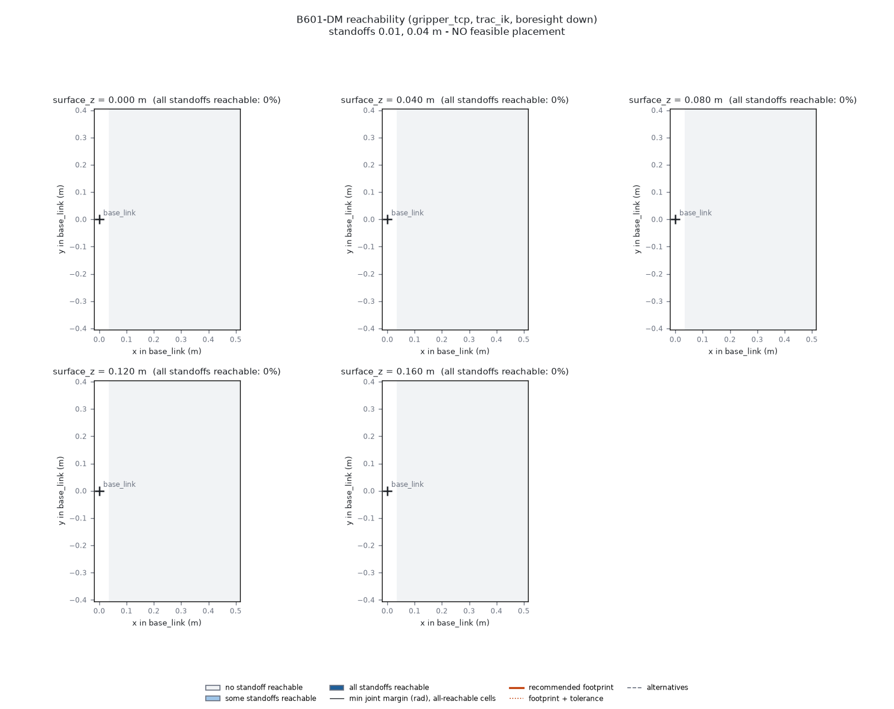

# REACHABILITY.md — B601-DM reachability map and specimen placement (MOT-04.5)

## 1. Purpose

This document answers one question: where on the bench can the crack specimen be placed so the
B601-DM can put its inspection tool boresight-down over every point of the specimen? To answer it,
this card ran a MoveIt/TRAC-IK reachability sweep over the workspace configured in
`config/motion/reachability.yaml`. `recommend_placement` (MOT-04.3) then scored the map under the
normative rule in `docs/INTERFACES.md` §7.3.

**Headline result: with the committed config, no placement is feasible.** Every one of the
4320 swept targets is `unreachable`: 0 reachable, 0 errors, 0 FK mismatches and 0 prefiltered.
`config/motion/specimen_placement.yaml` is therefore `feasible: false`, `placement: null`,
`max_feasible_square_m: 0`. Section 6 gives the cause, which is geometric and not a solver
failure. Section 9 lists the decision the operator has to make before a real recommendation can
exist. Nothing was shrunk or loosened to manufacture a feasible result.

Everything here ran against the mock ros2_control stack (`mock_components/GenericSystem`). The
sweep only sends IK and FK queries (`/compute_ik`, `/compute_fk`) and never commands a trajectory,
so nothing moved.

## 2. Method

- **Model / solver.** The canonical B601-DM model, served by the mock stack's `move_group`
  (`docs/motion/ROBOT_MODEL.md`), with the `arm` group and IK tip `gripper_tcp`. IK comes from
  MoveIt `/compute_ik` using the group's configured `trac_ik_kinematics_plugin`, with
  `timeout_s = 0.02` and `avoid_collisions: true`. Seeds are the neighbouring target's solution,
  falling back to the SRDF `home` state.
- **Orientation.** Boresight-down. The tool's local boresight `axis_local = [1, 0, 0]` of
  `gripper_tcp` (prior evidence per INTERFACES §6.5, not GEOM-07-calibrated) is aligned with world
  `[0, 0, -1]`. It is sampled at 8 rolls about that axis. `tilt_deg = [0]`, so the 4 azimuth
  samples collapse to one: 8 orientations per target, with `roll_search: best` (every roll is
  tried and the best joint-limit margin is kept).
- **Targets.** Each grid node `(x, y)` sits on a surface at height `surface_z`. The TCP is
  commanded to `(x, y, surface_z + standoff)` for each configured standoff.
- **Surface slab.** For each `surface_z` layer, a collision box `mot04_surface` is added to the
  planning scene. It is `thickness_m = 0.02` thick, with its top at `surface_z`, and extends
  `margin_m = 0.05` beyond the grid on every side. `base_link` and `link1` are allowed to touch it.
  This makes IK reject any solution whose links pass through the specimen or table.
- **FK re-check.** Every IK success is independently re-checked with `/compute_fk`. It counts as
  `reachable` only if the FK pose agrees within 1 mm and 0.5°. Otherwise it is `fk_mismatch`.
- **Prefilter.** Targets beyond `reach_bound_from_urdf` (1.006556 m from `/robot_description`)
  are marked `prefiltered` without calling IK. No target in this grid is that far out.
- **Placement.** Scored with the §7.3 rule: a 0.20 × 0.20 m footprint, dilated by a 0.02 m
  tolerance on every side, at yaw 0 or 90°. Every grid node inside the dilated footprint must be
  reachable at every standoff.

### Grid change (runtime)

The committed grid step changed from **0.025 m to 0.03 m** (the card's maximum). The y extent
changed from ±0.40 to **±0.39 m** so that `(max − min)/step` is integral, as `load_config`
requires. x stays 0.05–0.50 m. Surface heights, standoffs, orientation, IK and collision settings
are unchanged.

Reason: at 0.025 m the sweep has 6270 targets at about 0.42 s each (8 rolls × IK timeout when
nothing solves), roughly 44 min in total. The previous attempt at this card ran the 0.025 m grid
twice. The first stopped at 40 % and wrote a `complete: false` map, which was then discarded.
The second reached 5643/6270 targets (90 %), **every one of them `unreachable`**, before the
session's time limit ended it. Neither produced a `complete: true` map. At 0.03 m the sweep has 4320 targets and fits. The unreachable-everywhere
result is the same at both steps.

## 3. Commands

```bash
bash scripts/ros/build_ws.sh
bash scripts/ros/run_reachability.sh --reachability-config config/motion/reachability.yaml \
    --out data/motion/reachability_map.json --max-duration-s 2400
bash scripts/ros/env_ros.sh bash -c 'source ros2_ws/install/setup.bash && \
    ros2 run crackvision_motion recommend_placement --map data/motion/reachability_map.json \
    --out config/motion/specimen_placement.yaml --emit-verify-config config/motion/placement_verify.yaml'
bash scripts/ros/run_reachability.sh --reachability-config config/motion/placement_verify.yaml \
    --out logs/placement_verify_map.json --require-all-reachable
./env.sh python scripts/motion/plot_reachability.py --map data/motion/reachability_map.json \
    --placement config/motion/specimen_placement.yaml --out docs/motion/figures/reachability.png
```

`data/motion/reachability_map.json` is git-ignored generated evidence. Re-run the sweep to
reproduce it.

## 4. Results

| Item | Value |
|---|---|
| Map | `data/motion/reachability_map.json`, `complete: true` |
| Map sha256 | `b43a6a7b13ab8b18bc316cba9917b146d25d64a5ee396d7c1d5a038356c0f08f` |
| Config sha256 (`config/motion/reachability.yaml`) | `d0a1180cdfa23d9eae12489f7b82eec19d6ae4ee8fcb95a1e8f72c2e74d5fe4b` |
| git commit recorded in map | `1d264d410cce7cd4caaf4fc92bf07ebd81167b55` |
| Sweep duration (`duration_s`) | 1802.7 s (wall time incl. mock-stack bring-up: 30 min 14 s) |
| Targets | 4320 = 16 x × 27 y × 5 surface_z × 2 standoffs |
| counts_by_status | `unreachable: 4320` (reachable 0, prefiltered 0, fk_mismatch 0, error 0). Every target made 8 IK calls (all rolls tried), ~0.41 s per target, `error` empty on all |

Reachable fraction per surface_z (`summary.reachable_fraction_by_surface_z`):

| surface_z (m) | reachable fraction |
|---|---|
| 0.00 | 0.0 |
| 0.04 | 0.0 |
| 0.08 | 0.0 |
| 0.12 | 0.0 |
| 0.16 | 0.0 |



The figure has one panel per surface_z. Each cell is coloured by the fraction of standoffs that
are reachable, with `base_link` marked at the origin. Every cell is in the lightest class ("no
standoff reachable"), so there is no joint-margin contour and no footprint to draw.

**Recommended placement:** none. `recommend_placement` exited **1** (no feasible placement,
§7.4). It wrote `config/motion/specimen_placement.yaml` with `feasible: false`, `placement: null`,
`alternatives: []` and `max_feasible_square_m: 0.0`, with `map_sha256` equal to the map
sha256 above. It emitted no `placement_verify.yaml` because there is nothing to verify.

## 5. Independent verification

The half-step verification sweep (`config/motion/placement_verify.yaml` →
`logs/placement_verify_map.json`, `--require-all-reachable`) samples points that the map never
sampled, at half the map's step, inside the recommended footprint. **It could not run**, because
there is no recommended footprint, so no verify config was emitted. The card's `placement-verify`
and `placement-feasible` checks fail by design: an infeasible result must fail its feasibility
check rather than be loosened. Actual run (2026-09-29): `run_reachability.sh --reachability-config config/motion/placement_verify.yaml --out logs/placement_verify_map.json --require-all-reachable` exited **1**. The sweep node raised `No such file or directory: config/motion/placement_verify.yaml` and wrote no map. So there is **no independent verification evidence** for any placement yet.

## 6. Why everything is unreachable (diagnosis)

`gripper_tcp` is defined as `xyz = −0.0443 0 0` from `gripper_link` (ROBOT_MODEL.md §4). With the
boresight `+x` of `gripper_tcp` pointing straight down, `gripper_link` therefore sits **44.3 mm
below** the commanded TCP point. The gripper body extends below that point too. At standoffs of
0.01 m and 0.04 m, the gripper body goes through the 2 cm surface slab. For every roll, IK with
`avoid_collisions: true` then correctly reports no collision-free solution. MOT-04.4 recorded the
same finding in its fixture probe (docs/motion/ROS_WORKSPACE.md, "Fixture probe"). At
(0.20, 0, 0.12), standoffs 0.01 and 0.04 reached 0/8 rolls, while standoffs 0.06–0.10 reached
7–8/8.

**Diagnostic check (not the deliverable).** To confirm the cause is the standoff and not a broken
pipeline, the same sweep node was run on a throwaway copy of the config under `logs/`
(`logs/mot045_diag_standoff006.yaml`, not committed). The copy had a 0.06 m grid, surface_z
{0.04, 0.12} and a single standoff of 0.06 m. Every other setting (orientation, IK, collision
slab) was unchanged. Result (234 targets, `complete: true`, run 2026-09-29):

| diagnostic layer | reachable at standoff 0.06 m |
|---|---|
| surface_z 0.04 | 87/117 (74 %). Along y = 0, reachable from x = 0.11 to 0.47. Min joint margin 0.37 rad at x = 0.11, 0.57 rad at x = 0.23, 0.39 rad at x = 0.41, 0.18 rad at x = 0.47. x = 0.05 and 0.53 unreachable. FK position error ≤ 1.4e-5 m |
| surface_z 0.12 | 0/117 (0 %) |

So the same pipeline does find collision-free, FK-verified solutions once the standoff clears
the gripper body. The 0 % at surface_z 0.12 is itself informative. The sweep models the surface
as one slab spanning the whole grid plus the 0.05 m margin, so it runs from x ≈ 0 m, under the
arm's own base column, and only `base_link`/`link1` are allowed to touch it. A 2 cm slab at
0.10–0.12 m then probably intersects the shoulder links for every arm pose. That is a property
of the generic slab, not of a real specimen, and the real MOT-03 scene is what should replace
it. This diagnostic is evidence about the *cause* only. It is not a recommendation, and its
0.06 m standoff is not the committed inspection requirement.

So the committed standoffs 0.01/0.04 m are not achievable with this tool definition and the
collision slab. Either the standoff is measured from the wrong frame (the physical tool tip is
around `gripper_link` or beyond, not `gripper_tcp`), or the boresight sign/TCP definition is
wrong. Both are open questions for GEOM-07.

## 7. Comparison with TECHNICAL_APPROACH §2.5

The presentation's §2.5 sweep found the coupon at x = 0.22 m good (18/18 waypoints < 2 mm) and at
x = 0.42 m poor (5/18). It differed from this sweep in several ways:

- **Tool frame.** It used `gripper_link` as the tool point. This sweep uses `gripper_tcp`, which is
  44.3 mm away along `gripper_link`'s x axis. With boresight-down, a given surface point therefore
  needs a different wrist position in the two setups.
- **Solver.** It used a custom damped-least-squares IK with a 5-DOF constraint (position + boresight
  axis, roll free), with no collision checking. This sweep uses TRAC-IK through MoveIt with a full
  6-DOF pose per roll sample, collision-checked against the surface slab, and FK-re-checked.
- **Surface.** Its coupon surface was at z = 0.12 m, with crack waypoints essentially on the
  surface and approach/retract 0.04–0.145 m above it.

What this map says near those points, at surface_z = 0.12 m (the matching layer):
The 0.03 m grid has no node exactly at 0.22 or 0.42 on y = 0. The nearest are x = 0.23 and
x = 0.41. All four targets there (standoffs 0.01 and 0.04) are `unreachable`, with 8/8 rolls
failing IK: `z03_x006_y013_s0/s1` at x = 0.23 and `z03_x012_y013_s0/s1` at x = 0.41. In the
§6 diagnostic (standoff 0.06 m), both points are also unreachable at surface_z 0.12. At
surface_z 0.04 both are reachable, with the min joint-limit margin falling from 0.57 rad at
x = 0.23 to 0.39 rad at x = 0.41. That is qualitatively the same direction as §2.5 (x = 0.42
closer to the joint limits than x = 0.22), but it is measured at a different surface height,
standoff, tool frame and solver, so it is not a reproduction of §2.5.

**Agreement with §2.5 cannot be claimed or refuted from this map.** Here every target, near and
far, is excluded by the collision slab, whereas §2.5 had no collision model at all. The §2.5
contrast between x = 0.22 and x = 0.42 is about solver convergence near joint limits. This map
has no reachable cell at either x, so it cannot compare them. The diagnostic in §6 is the only
evidence here about the near/far contrast, and it uses a different standoff from both the
committed config and §2.5.

## 8. What is not yet known, and re-run triggers

The config values are all `nominal`. The map and any recommendation must be regenerated (sweep →
`recommend_placement` → verify → plot) when any of the following changes:

- **GEOM-03 (camera mount).** A mounted camera changes the tool's collision geometry and possibly
  the tool frame.
- **GEOM-07 (TCP / boresight calibration).** Replaces the prior-evidence `boresight.axis_local`
  and settles which frame the standoff is measured from. **This is the most likely fix for the
  infeasibility above** (see §6).
- **MOT-03 (collision scene).** Real table, fixtures and specimen geometry replace the generic
  surface slab.
- **MOT-10 (measured workcell).** Measured surface height, bench extents and as-placed specimen
  pose.
- Any change to `config/robot/b601_dm_limits.yaml` (joint limits feed the joint-margin score), the
  URDF/SRDF, or the configured IK plugin.

## 9. Handoff to MOT-10 / MOT-03

`config/motion/specimen_placement.yaml` is the pose the operator is meant to target. MOT-10 then
measures the real, as-placed specimen pose, and that measurement supersedes this file for every
downstream consumer. **Today there is no pose to hand over** (`feasible: false`). Before MOT-10
can use this, the operator has to decide one of the following:

1. Change `grid.standoffs_m` in `config/motion/reachability.yaml` to values that clear the gripper
   body (the §6 diagnostic shows 0.06 m works at surface_z 0.04 but not at 0.12), and/or
   restrict the surface slab to the specimen area instead of the whole grid, or
2. Wait for GEOM-07 to establish the real tool tip and boresight, then re-run.

Then re-run §3 end to end. This card did not make that change, because the standoffs are an
inspection requirement, not a sweep-runtime knob.

`config/scene/**` from MOT-03 does not exist yet. When it does, its specimen collision object
should take its nominal pose from `specimen_placement.yaml`: centre `placement.center_xy_m`, top
face at `placement.surface_z_m`, yaw `placement.yaw_rad`, size `placement.footprint_m`. It should
be tagged `nominal` until MOT-10's measurement replaces it with a `measured` pose. That follows the
`value_status: nominal|measured` vocabulary already used by this file and
`config/motion/reachability.yaml`.
