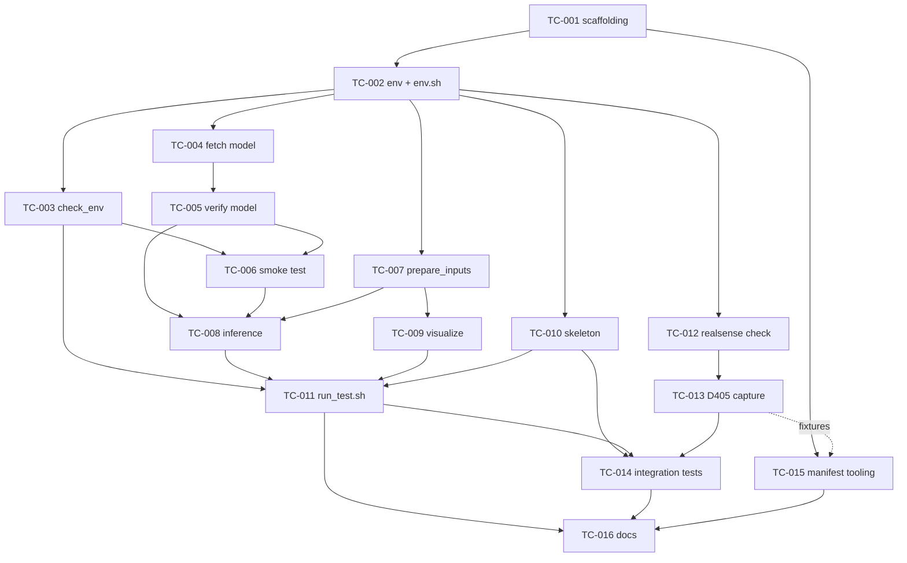

# TASK_INDEX.md — dependency map and status board

> **Frozen 2026-09-28.** Canonical planning and status moved to claude-auto: `plan/` (cards, requirements, responsibility tree) + `.claude-auto/` (runtime state). Run `claude-auto status`. This board reflects the retired cv-harness as of 2026-09-19 and is kept as history; TC-001…016 were imported as claude-auto cards.


**Statuses:** `READY` · `BLOCKED` (prerequisites unmet) · `IN PROGRESS` · `COMPLETE` · `PARTIAL` · `SKIPPED`

Each agent updates this table at the end of its card: set its own row, then flip any card whose
prerequisites are now all satisfied from `BLOCKED` to `READY`.

---

## Status board

| ID | Task | Depends on | Complexity | Status | Agent |
|---|---|---|---|---|---|
| TC-001 | Project scaffolding and Git hygiene | — | SMALL | COMPLETE | Sonnet |
| TC-002 | Python environment, dependencies, `env.sh` | TC-001 | MEDIUM | COMPLETE | Sonnet |
| TC-003 | Environment verification (Level 1) | TC-002 | SMALL–MED | COMPLETE | Sonnet |
| TC-004 | OpenCrack model acquisition | TC-002 | SMALL–MED | COMPLETE | Sonnet |
| TC-005 | nnU-Net wiring + semantic validation | TC-004 | SMALL | COMPLETE | Sonnet |
| TC-006 | Synthetic end-to-end smoke test (Level 2) | TC-003, TC-005 | MEDIUM | COMPLETE | Sonnet |
| TC-007 | Input preparation + naming contract | TC-002 | MEDIUM | COMPLETE | Sonnet |
| TC-008 | Batch inference runner | TC-005, TC-006, TC-007 | MEDIUM | COMPLETE | Sonnet |
| TC-009 | Visualization pipeline | TC-007 | MEDIUM | COMPLETE | Sonnet |
| TC-010 | Skeletonization utility | TC-002 (TC-007 for real data) | SMALL–MED | **READY** | Sonnet |
| TC-011 | One-command runner `run_test.sh` | TC-003, TC-007, TC-008, TC-009, TC-010 | MEDIUM | BLOCKED | Sonnet |
| TC-012 | RealSense software validation | TC-002 | SMALL | **READY** | Sonnet |
| TC-013 | D405 capture utility | TC-012 | **COMPLEX** | BLOCKED | Sonnet |
| TC-014 | Integration + contract + hygiene tests | TC-010, TC-011, TC-013 | MEDIUM | BLOCKED | Sonnet |
| TC-015 | Evaluation-manifest tooling | TC-001 (TC-013 for fixtures) | SMALL–MED | BLOCKED | Sonnet |
| TC-016 | Documentation and reproducibility | TC-011, TC-014, TC-015 | SMALL–MED | BLOCKED | Sonnet |

**Complexity key** — `SMALL`: one file, narrow contract. `MEDIUM`: a module plus tests, some judgement.
`COMPLEX`: several interacting concerns (TC-013: lazy imports, hardware absence, binary fidelity,
metadata schema).

---

## Dependency graph



No cycles. TC-013→TC-015 is a soft edge (synthetic fixtures are convenient, not required — TC-015
can hand-write fixtures and says so).

---

## Recommended execution order (strictly sequential — the safe default)

```
TC-001 → TC-002 → TC-003 → TC-004 → TC-005 → TC-006 → TC-007 → TC-008
      → TC-009 → TC-010 → TC-011 → TC-012 → TC-013 → TC-014 → TC-015 → TC-016
```

This order is what the cards' `NEXT CARD:` fields point to. Follow it unless you are deliberately
parallelising.

---

## Parallelisation

Once **TC-002** is COMPLETE, six cards become independently runnable — they share no files:

| Wave | Cards | Why they are safe together |
|---|---|---|
| **A** (after TC-002) | **TC-003**, **TC-004**, **TC-007**, **TC-010**, **TC-012**, **TC-015** | disjoint file sets: `scripts/check_env.py` · `scripts/fetch_model.py`+`config/model_manifest.json` · `src/.../naming.py`+`prepare_inputs.py` · `src/.../skeleton.py` · `scripts/check_realsense.py` · `tools/dataset_manifest.py` |
| **B** | **TC-005** (after TC-004), **TC-009** (after TC-007), **TC-013** (after TC-012) | still disjoint |
| **C** | **TC-006** (after TC-003+TC-005) | first GPU use |
| **D** | **TC-008** (after TC-005, TC-006, TC-007) | touches `scripts/smoke_test.py` — must not overlap with TC-006 |
| **E** | **TC-011** (after TC-003, 007, 008, 009, 010) | orchestrator |
| **F** | **TC-014** → **TC-016** | must be last; TC-014 reads every component |

**Shared files that force serialisation:**
- `docs/COMPLETION_LOG.md` and `task_cards/TASK_INDEX.md` — appended by *every* card. Parallel agents
  must append, never rewrite; resolve any conflict by keeping both entries.
- `tests/conftest.py` — created by TC-007, extended by TC-014. Do not run those two concurrently.
- `scripts/smoke_test.py` — created by TC-006, edited by TC-008 (one substitution only).
- `tests/test_realsense_import.py` — created by TC-012, extended by TC-013.
- `README.md` — quickstart section by TC-011, full rewrite by TC-016.

**Recommendation:** run sequentially. The ordering above costs little and removes every merge
hazard. Parallelise only Wave A, and only if you are running agents concurrently on purpose.

---

## File ownership

One card creates each file. Nothing else may create or rewrite it.

| File / directory | Created by | May be modified by |
|---|---|---|
| `.gitignore`, `pyproject.toml`, `config/project.yaml` | TC-001 | — |
| `src/crackvision/config.py`, `logging_setup.py`, `__init__.py` | TC-001 | — |
| `env.sh`, `requirements/**` | TC-002 | TC-012 (realsense pin), TC-016 (pin core) |
| `scripts/check_env.py` | TC-003 | — |
| `scripts/fetch_model.py`, `config/model_manifest.json` | TC-004 | — |
| `scripts/verify_model.py` | TC-005 | — |
| `scripts/smoke_test.py` | TC-006 | TC-008 (swap to `run_inference()` only) |
| `src/crackvision/naming.py`, `prepare_inputs.py` | TC-007 | — |
| `tests/conftest.py` | TC-007 | TC-014 (add fixtures) |
| `tests/test_naming.py`, `test_prepare_inputs.py` | TC-007 | — |
| `src/crackvision/inference.py` | TC-008 | — |
| `src/crackvision/visualize.py`, `tests/test_visualize.py` | TC-009 | — |
| `src/crackvision/skeleton.py`, `tests/test_skeleton.py` | TC-010 | — |
| `run_test.sh`, `scripts/summarize_run.py` | TC-011 | — |
| `scripts/check_realsense.py` | TC-012 | — |
| `tests/test_realsense_import.py` | TC-012 | TC-013 (add tests) |
| `src/crackvision/realsense_capture.py` | TC-013 | — |
| `tests/test_integration_smoke.py`, `test_contracts.py` | TC-014 | — |
| `tools/dataset_manifest.py`, `tests/test_dataset_manifest.py` | TC-015 | — |
| `README.md` | TC-001 (placeholder) | TC-011 (quickstart), TC-016 (full) |
| `docs/COMPLETION_LOG.md` | TC-001 | **every card — append only** |
| `task_cards/TASK_INDEX.md` | planning | every card (status cells); re-synced from canonical state by the harness |
| `docs/ENVIRONMENT_SNAPSHOT.md`, `RUNBOOK.md`, `LICENSE-NOTICES.md` | TC-016 | — |
| `docs/ARCHITECTURE.md`, `INTERFACES.md`, `RISKS.md`, `VALIDATION_PLAN.md`, `D405_TEST_PLAN.md`, `MACHINE_STATE.md`, `IMPLEMENTATION_PLAN.md`, `adr/**` | planning session | **nobody** (TC-016 may *append* an "Implementation notes" section to `ARCHITECTURE.md`) |
| `docs/ORCHESTRATION.md` | harness | **nobody** |
| `.task_orchestrator/**`, `~/.local/bin/cv-*` | harness | **nobody — this is the review gate** |
| `docs/REVIEW_LOG.md`, `.task_orchestrator/reviews/**` | `cv-review` (Opus) | **no implementation agent** |
| `task_cards/TC-*.md`, `AGENT_INSTRUCTIONS.md` | planning session | **nobody** |

---

## Progress

```
TC-001, TC-002, TC-003, TC-004, TC-005, TC-006, TC-007, TC-008, TC-009 █████████░░░░░░░  9 / 16 complete
```

TC-002 delivered the `crackvision` conda env (Python 3.11), CUDA torch 2.14.0+cu126, nnunetv2 2.8.1,
the pinned imaging stack, and the `env.sh` scrubbing launcher. TC-004 downloaded and hashed the
OpenCrack nnU-Net snapshot into `models/opencrack-nnunet/`; `check_env.py`'s model rows are now
PASS. TC-005 built `scripts/verify_model.py` and is now COMPLETE: a corrupted local `plans.json`
(one stray trailing byte, a hardlink write-through from TC-004's own review scratch tree — see
`docs/COMPLETION_LOG.md`) was repaired via `./env.sh python scripts/fetch_model.py --force`
(re-verified: only `downloaded_utc` changed, all six manifest sha256/bytes values identical), after
which all 14 core checks plus `--check-hashes` PASS. TC-006 built `scripts/smoke_test.py` and is now
COMPLETE: the real OpenCrack checkpoint ran end-to-end via `nnUNetv2_predict_from_modelfolder` on
both CUDA and CPU against two synthetic fixtures, producing well-formed `{0,1}`-valued uint8
512×512 predictions. A previously-undiscovered upstream fact surfaced in the process — the
checkpoint's internal `trainer_name` metadata is a custom trainer (`nnUNetTrainerSaveEvery10`) not
shipped with nnunetv2 2.8.1 — worked around via nnU-Net's own documented `nnUNet_extTrainer`
extension point with a shim file generated at runtime under `data/smoke_test/ext_trainer/` (never
under `models/`); see `docs/COMPLETION_LOG.md` for the full evidence trail. TC-007 built
`src/crackvision/naming.py` (the case_id contract) and `src/crackvision/prepare_inputs.py` (forces
arbitrary imagery to 3-channel 8-bit RGB PNG + writes `data/case_map.json`) and is now COMPLETE: 37
new tests in `tests/test_naming.py`/`tests/test_prepare_inputs.py` all pass, including every row of
the `INTERFACES.md` §1.1 case-id table, every required Pillow-mode fixture (RGBA, grayscale,
palette, CMYK, 16-bit, EXIF-rotated), and the corrupt-file/empty-dir/idempotency/dry-run/clean/
skip-existing acceptance criteria; see `docs/COMPLETION_LOG.md` for two internally-contradictory
rows found in the §1.1 table (implemented per the algorithm, not per the contradicting literal
answer text — flagged there for whoever next touches `docs/INTERFACES.md`). TC-008 built
`src/crackvision/inference.py` and is now COMPLETE: `run_inference()` builds the
`nnUNetv2_predict_from_modelfolder` command (with the mandatory `-f 0`/`-chk checkpoint_ep0500.pth`
overrides), checks all five documented preconditions before launching anything, verifies one
prediction per input afterwards, and detects CUDA OOM without retrying or killing anything. It also
now owns the `nnUNet_extTrainer` shim for the checkpoint's undocumented custom trainer name
(previously private to `scripts/smoke_test.py`, TC-006), writing it to `logs/ext_trainer/` so both
the CLI and the smoke test share one implementation; `scripts/smoke_test.py` was refactored to call
`run_inference()` instead of building its own subprocess command, per this card's one authorised
edit to that file, and still passes with byte-identical assertions. Both `-m` (default) and
`--use-dataset-id` (`-d 501 -c 2d`, proving TC-005's symlink) invocation forms were run for real on
CUDA and CPU. TC-009 remains READY (unaffected by this card); TC-010 flipped to READY when TC-007
completed (harness-synced, not this card's doing).

TC-009 built `src/crackvision/visualize.py` and is now COMPLETE: `visualize_case()` binarises
defensively (`pred > 0`, proven against both `{0,1}` and `{0,255}` fixtures), renders
`{case}_mask.png`/`{case}_overlay.png`/`{case}_comparison.png` (alpha-blended in float per
`docs/INTERFACES.md` §3.3, never in uint8), and hard-fails only the mismatched case on a
prediction/original shape mismatch while the rest of the batch continues. The original is loaded
with the same `exif_transpose` + `convert("RGB")` treatment `prepare_inputs` gave it, so an
EXIF-rotated source's dimensions still match its prediction — closing the integration risk TC-007's
review flagged for this card. 9 new tests in `tests/test_visualize.py` all pass (46/46 total across
the suite), and a full real run (`prepare_inputs` → real GPU `nnUNetv2_predict_from_modelfolder` →
`visualize`) against a synthetic crack image in an isolated scratch root confirmed the whole chain
end-to-end, including `--alpha`/`--color` overrides, `--skip-existing`, and an unknown `--cases` id
being reported and counted as failed without aborting the batch; see `docs/COMPLETION_LOG.md` for
the full evidence trail. TC-010 remains READY (unaffected by this card); TC-011 stays BLOCKED until
TC-010 also completes.
